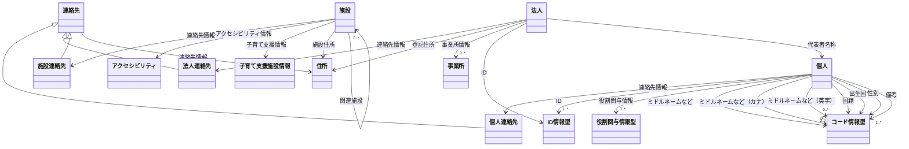

```mermaid
classDiagram
  連絡先 <|-- 個人連絡先
  連絡先 <|-- 法人連絡先
  連絡先 <|-- 施設連絡先
  連絡先 --> 住所 : 連絡先情報

  施設 --> 施設連絡先 : 連絡先情報
  施設 --> アクセシビリティ : アクセシビリティ情報
  施設 --> 子育て支援施設情報 : 子育て支援情報
  施設 --> 住所 : 施設住所
  施設 --> "0..*" 施設 : 関連施設

  法人 --> 法人連絡先 : 連絡先情報
  法人 --> 住所 : 登記住所
  法人 --> "0..*" 事業所 : 事業所情報
  法人 --> ID情報型 : ID
  法人 --> 個人 : 代表者名称

  個人 --> 個人連絡先 : 連絡先情報
  個人 --> "1..*" ID情報型 : ID
  個人 --> "0..*" 役割関与情報型 : 役割関与情報
  個人 --> "0..*" コード情報型 : ミドルネームなど
  個人 --> "0..*" コード情報型 : ミドルネームなど（カナ）
  個人 --> "0..*" コード情報型 : ミドルネームなど（英字）
  個人 --> コード情報型 : 国籍
  個人 --> コード情報型 : 出生国
  個人 --> コード情報型 : 性別
  個人 --> "1..*" コード情報型 : 備考
```
